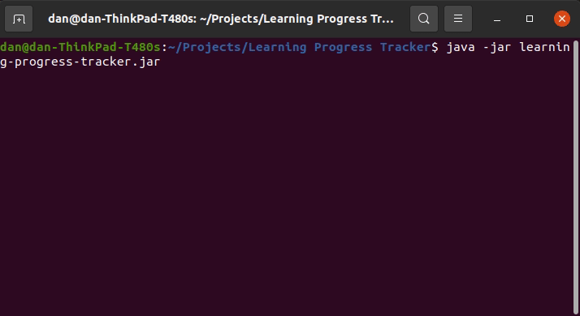
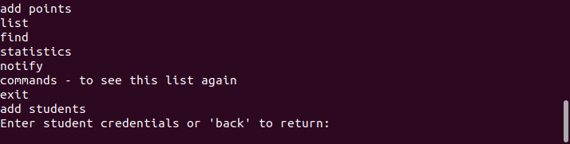
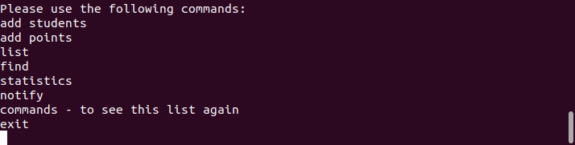
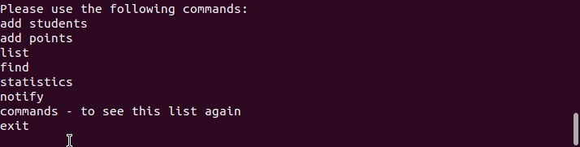

<h1 align="center">LearningTracker</h1>

 

</img>

<h2>About</h2>

This was a project that I completed as part of Hyperskill's Java Back End Developer track. [More info here
](https://hyperskill.org/projects/197?track=12)

Overall I found this to be a great project as I was able to use language features that I had learnt to test in a real project. I focused on using Java 8 streams where I could, while also using Comparators and many different collection types. 
Due to Hyperskill releasing requirements of the project in stages, I do feel that certain parts of the program are messy with regards to the relationships between certain classes. Given the opportunity again and knowing the full specification I would better plan the overall structure of the project. In addition each stage had to pass all the required tests which is why information is required to be inputted in certain cumbersome ways.

<h2>Key learnings</h2>

- Streams
- Regex in Java
- Comparators
- Program structure

<h2>Installation</h2>

1. Download learning-progress-tracker.jar
2. Run `java -jar learning-progress-tracker.jar`

<h2>Demo</h2>

**Adding students to the program**

  

  
  

  
  **Example of regex rules for checking appropriate names and emails are entered**

  

  
  

  **Points can be added for each of a students modules - with statistics displaying certain metrics**

  

  
  

  
   **Once a threshold of points has been surpassed - we can notify passing students of each module**

  

  
  

